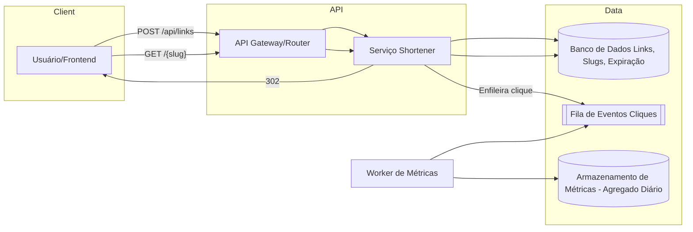

# Mini Encurtador de URLs para Campanhas Locais

**Nível:** básico  
**Tema(s):** APIs REST, persistência simples, redirecionamento HTTP, rate limiting básico  
**Resumo do problema:**  
Uma pequena agência de marketing precisa de um encurtador de URLs para acompanhar cliques de campanhas locais. O produto inicial deve permitir criar links curtos, redirecionar de forma rápida e registrar contagens de cliques por dia. O sistema será usado por poucos clientes (dezenas) e tráfego moderado (centenas a poucos milhares de cliques/dia).

## Requisitos Funcionais

- Permitir **criar** uma URL curta a partir de uma URL longa via API (ex.: `POST /api/links`).
- **Redirecionar** solicitações `GET /{slug}` para a URL longa correspondente, usando HTTP 301/302.
- Registrar **métrica de cliques** por data (ex.: total diário) e expor consulta simples (ex.: `GET /api/links/{slug}/stats?from=YYYY-MM-DD&to=YYYY-MM-DD`).
- Validar **formato** de URL longa (http/https) e rejeitar entradas inválidas.
- Opcional: permitir **expiração** do link (data de validade) e **notas**/rótulos para organização.

## Requisitos Não Funcionais

- **Latência**: redirecionamento abaixo de 100 ms p95 dentro da mesma região.
- **Disponibilidade**: 99,5% mensal é suficiente para o MVP.
- **Consistência**: leitura do redirecionamento deve ser **forte**; métricas podem ser atualizadas de forma **assíncrona** (eventual).
- **Observabilidade**: logs de acesso, métricas de p95/p99 e contador de erros 5xx.
- **Segurança**: validar domínio de destino opcionalmente (lista de bloqueio), limitar criação por **chave de API**.
- **Custos**: preferir componentes gerenciados/básicos de baixo custo (um banco relacional leve ou KV, cache opcional).

## Diagrama Conceitual (Mermaid)

## Desafio

Escalar o sistema para:

- 100 TPS
- 1.000 TPS
- 10.000 TPS
- 100.000 TPS

## Implementação (MVP)

- Arquitetura TPS (Transport / Processing / Storage): ver `docs/PLAN.md`.
- Banco: **MongoDB** (collections `links` e `clicks_daily`).
- Endpoints:
  - `POST /api/links`
  - `GET /{slug}`
  - `GET /api/links/{slug}/stats?from=YYYY-MM-DD&to=YYYY-MM-DD`

## Como rodar

1) Suba MongoDB + API (5 instâncias) + Nginx + Kong:
- `docker compose up -d --build`

2) Teste rápido (Kong e Nginx exigem `X-User`):
- Criar link: `curl -X POST http://localhost:8080/api/links -H 'Content-Type: application/json' -H 'X-User: demo' -d '{"url":"https://example.com"}'`
- Redirecionar: abra `http://localhost:8080/<slug>` com header `X-User`

## Teste de carga k6 (API Gateway, incluindo inserções)

Pré-requisito:
- `k6` instalado ([https://k6.io/docs/get-started/installation/](https://k6.io/docs/get-started/installation/))
- stack ativa com `docker compose up -d --build`

Script:
- `tests/k6/api_gateway_tps.js`
- guia detalhado: `tests/k6/README.md`

Modo padrão do teste:
- `mixed` (testa tudo): `POST /api/links` + `GET /{slug}` + `GET /api/links/{slug}/stats`

Comandos prontos:
- `make k6-gateway` (mixed local-safe fixo: 1000 TPS, sem create para evitar rate limit padrão)
- `make k6-gateway-100k` (mixed com `LT_TARGET_TPS=100000`)
- `make k6-gateway-create` (somente inserções)
- `make k6-gateway-redirect` (somente redirecionamento)
- `make k6-gateway-stats` (somente stats)
- `make k6-gateway-health` (somente health)

Observação para execução local:
- ao testar contra `localhost`, perfis muito altos de `LT_TARGET_TPS`/`LT_MAX_VUS` podem esgotar portas efêmeras do cliente e gerar `connect: can't assign requested address`
- para 100k TPS, prefira geradores distribuídos/múltiplos IPs e ajuste de limites do host
- o script agora falha rápido para perfil extremo em `localhost`; para forçar, use `LT_ALLOW_EXTREME_LOCALHOST=true`

Importante para testes de inserção:
- o endpoint de criação usa rate limit por minuto (default `CREATE_RATE_LIMIT_PER_MINUTE=60`)
- para estresse real de inserção, suba com limite alto, por exemplo:
  `CREATE_RATE_LIMIT_PER_MINUTE=1000000 docker compose up -d --build`

Variáveis suportadas:
- `LT_MODE` (`mixed|create|redirect|stats|health`, default: `mixed`)
- `LT_BASE_URL` (default: `http://localhost:8080`)
- `LT_X_USER` (default: `k6-load`)
- `LT_API_KEY` (opcional)
- `LT_CREATE_URL` (default: `https://example.com`)
- `LT_DURATION` (default: `1m`)
- `LT_TARGET_TPS` (default: `1000`)
- `LT_PRE_ALLOCATED_VUS` (default: `400`)
- `LT_MAX_VUS` (default: `4000`)
- `LT_HTTP_TIMEOUT` (default: `5s`)
- `LT_SEED_LINKS` (default: `20`, slugs criados no setup para redirect/stats)
- `LT_MIXED_CREATE_PCT` (default: `10`)
- `LT_MIXED_REDIRECT_PCT` (default: `80`)
- `LT_MIXED_STATS_PCT` (default: `10`)
- `LT_MIXED_HEALTH_PCT` (default: `0`)
- `LT_EXPECTED_CREATE_STATUSES` (default: `201`)
- `LT_EXPECTED_REDIRECT_STATUSES` (default: `301,302`)
- `LT_EXPECTED_STATS_STATUSES` (default: `200`)
- `LT_EXPECTED_HEALTH_STATUSES` (default: `200`)

## Modo de execução (High TPS)

O projeto agora roda apenas com o entrypoint de alta vazão em `cmd/api_hightps`:

- Rodar local: `make run` (ou `go run ./cmd/api_hightps`)
- Otimizações: buffer de cliques com `BulkWrite` no Mongo
- Defaults otimizados: sem logs/metrics no hot path e tracing OpenTelemetry sempre ativo

Variáveis úteis (opcionais):
- `CLICK_BUFFER_ENABLED=true`
- `CLICK_BUFFER_FLUSH_INTERVAL=250ms`
- `CLICK_BUFFER_MAX_BATCH_EVENTS=50000`
- `HTTP_ENABLE_LOGGING=false`
- `HTTP_ENABLE_METRICS=false`
- `REDIRECT_FAST=true`
