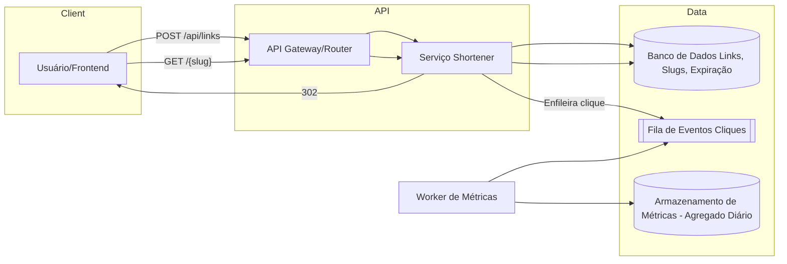

# Mini Encurtador de URLs para Campanhas Locais

**Nível:** básico  
**Tema(s):** APIs REST, persistência simples, redirecionamento HTTP, rate limiting básico  
**Resumo do problema:**  
Uma pequena agência de marketing precisa de um encurtador de URLs para acompanhar cliques de campanhas locais. O produto inicial deve permitir criar links curtos, redirecionar de forma rápida e registrar contagens de cliques por dia. O sistema será usado por poucos clientes (dezenas) e tráfego moderado (centenas a poucos milhares de cliques/dia).

## Requisitos Funcionais

- Permitir **criar** uma URL curta a partir de uma URL longa via API (ex.: `POST /api/links`).
- **Redirecionar** solicitações `GET /{slug}` para a URL longa correspondente, usando HTTP 301/302.
- Registrar **métrica de cliques** por data (ex.: total diário) e expor consulta simples (ex.: `GET /api/links/{slug}/stats?from=YYYY-MM-DD&to=YYYY-MM-DD`).
- Validar **formato** de URL longa (http/https) e rejeitar entradas inválidas.
- Opcional: permitir **expiração** do link (data de validade) e **notas**/rótulos para organização.

## Requisitos Não Funcionais

- **Latência**: redirecionamento abaixo de 100 ms p95 dentro da mesma região.
- **Disponibilidade**: 99,5% mensal é suficiente para o MVP.
- **Consistência**: leitura do redirecionamento deve ser **forte**; métricas podem ser atualizadas de forma **assíncrona** (eventual).
- **Observabilidade**: logs de acesso, métricas de p95/p99 e contador de erros 5xx.
- **Segurança**: validar domínio de destino opcionalmente (lista de bloqueio), limitar criação por **chave de API**.
- **Custos**: preferir componentes gerenciados/básicos de baixo custo (um banco relacional leve ou KV, cache opcional).

## Diagrama Conceitual (Mermaid)

## Desafio

Escalar o sistema para:

- 100 TPS
- 1.000 TPS
- 10.000 TPS
- 100.000 TPS

## Implementação (MVP)

- Arquitetura TPS (Transport / Processing / Storage): ver `docs/PLAN.md`.
- Banco: **MongoDB** (collections `links`, `clicks_daily` e `click_outbox`).
- Mensageria: **Kafka** (tópico `clicks.recorded`).
- Endpoints:
  - `POST /api/links`
  - `DELETE /api/links/{slug}`
  - `GET /{slug}`
  - `GET /api/links/{slug}/stats?from=YYYY-MM-DD&to=YYYY-MM-DD`

## Como rodar

1) Suba MongoDB + Kafka + API (5 instâncias) + worker de outbox + consumer + Nginx + Kong:
- `docker compose up -d --build`

2) Teste rápido (Kong e Nginx exigem `X-User`):
- Criar link: `curl -X POST http://localhost:8080/api/links -H 'Content-Type: application/json' -H 'X-User: demo' -d '{"url":"https://example.com"}'`
- Redirecionar: abra `http://localhost:8080/<slug>` com header `X-User`

Execução local sem compose (processos separados):
- API: `make run`
- Worker de outbox: `make run-outbox-worker`
- Consumer de cliques: `make run-click-consumer`

## Teste funcional k6 (CRUD via Kong)

Pré-requisito:
- `k6` instalado ([https://k6.io/docs/get-started/installation/](https://k6.io/docs/get-started/installation/))
- stack ativa com `docker compose up -d --build`

Script:
- `tests/k6/api_gateway_crud.js`
- guia detalhado: `tests/k6/README.md`

Fluxo por iteração:
- `POST /api/links`
- `GET /{slug}`
- `GET /api/links/{slug}/stats?from=YYYY-MM-DD&to=YYYY-MM-DD`
- `DELETE /api/links/{slug}`
- leitura após delete para validar `404`

Comandos prontos:
- `make k6-crud-smoke` (rápido, baixo volume)
- `make k6-crud` (perfil funcional padrão)

Variáveis suportadas (principais):
- `LT_BASE_URL` (default: `http://localhost:8080`)
- `LT_X_USER` (default: `k6-crud`)
- `LT_API_KEY` (opcional; necessário se `API_KEYS` estiver configurado)
- `LT_VUS` (default: `5`)
- `LT_ITERATIONS` (default: `30`)
- `LT_MAX_DURATION` (default: `2m`)
- `LT_HTTP_TIMEOUT` (default: `10s`)
- `LT_EXPECTED_REDIRECT_STATUSES` (default: `301,302`)
- `LT_EXPECTED_DELETED_STATUSES` (default: `404`)

## Modo de execução (High TPS)

O projeto agora roda apenas com o entrypoint de alta vazão em `cmd/api_hightps`:

- Rodar local: `make run` (ou `go run ./cmd/api_hightps`)
- Registro de cliques: `GET /{slug}` grava evento em outbox no MongoDB; worker publica no Kafka; consumer agrega em `links.clicks` e `clicks_daily`
- Consistência de métricas: eventual (com atraso curto conforme backlog)
- Defaults fixos: CORS/logging/metrics/tracing e redirect otimizado

Variáveis úteis (opcionais):
- `OTEL_EXPORTER_OTLP_ENDPOINT=http://localhost:4318`
- `KAFKA_BROKERS=kafka:9092`
- `KAFKA_CLICK_TOPIC=clicks.recorded`
- `KAFKA_CLICK_GROUP_ID=click-analytics`
