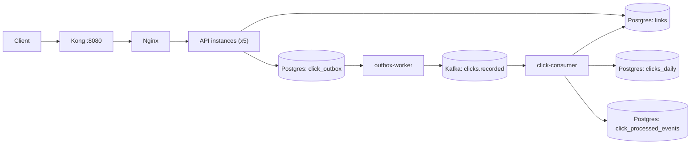

# Encurtador URL (High TPS + Outbox + Kafka)

URL shortener focused on high-throughput redirects and resilient click analytics.

Current architecture is PostgreSQL + Kafka with an outbox worker and deduplicating consumer.

## What Is Implemented

This repository ships 3 Go binaries:

- `cmd/api_hightps`: HTTP API for create/delete/stats/redirect
- `cmd/outbox_worker`: publishes pending click events from Postgres outbox to Kafka
- `cmd/click_consumer`: consumes click events and applies idempotent counters

Core behavior:

- Strong consistency for redirect lookup (`GET /{slug}`)
- Eventual consistency for click metrics (`GET /api/links/{slug}/stats`)
- Outbox pattern for reliable async delivery
- Transactional dedup with idempotency key (`event_id`) to prevent double counting
- Optional API key protection for write routes (`POST`/`DELETE`) when `API_KEYS` is set
- Observability with Prometheus metrics + OpenTelemetry traces

## Runtime Flow



Redirect click path:

1. `GET /{slug}` resolves active link and returns redirect (`301` or `302`).
2. API enqueues a click event in Postgres outbox (`click_outbox`).
3. Outbox worker claims and publishes to Kafka topic `clicks.recorded`.
4. Consumer runs one Postgres transaction per event: insert idempotency key, apply counters, commit.

## HTTP API

Routes registered in `internal/transport/http/router.go`:

- `GET /health`
- `GET /metrics`
- `POST /api/links`
- `DELETE /api/links/{slug}`
- `GET /api/links/{slug}/stats?from=YYYY-MM-DD&to=YYYY-MM-DD`
- `GET /{slug}`

Notes:

- `POST /api/links` and `DELETE /api/links/{slug}` require `X-API-Key` only when `API_KEYS` is configured.

### Create Link

`POST /api/links`

Request:

```json
{
  "url": "https://example.com/page",
  "notes": "campaign-a",
  "expiresAt": "2026-12-31T23:59:59Z"
}
```

Validation:

- `url` must be `http` or `https`
- `expiresAt` (if provided) must be in the future

### Redirect

`GET /{slug}`

Responses:

- `301` or `302` with `Location` header on success (`REDIRECT_STATUS`)
- `404` if slug does not exist
- `410` if link exists but is expired

### Stats

`GET /api/links/{slug}/stats?from=YYYY-MM-DD&to=YYYY-MM-DD`

Rules:

- `from` and `to` are required
- format must be `YYYY-MM-DD`
- `from <= to`
- zero-filled days are returned for the full range

## Response Envelope

Most API routes (`POST /api/links`, `DELETE /api/links/{slug}`, `GET /api/links/{slug}/stats`) use:

```json
{
  "responseTime": "2026-02-10T12:00:00Z",
  "correlationId": "uuid",
  "code": "LINK_CREATED",
  "data": {}
}
```

Error shape:

```json
{
  "responseTime": "2026-02-10T12:00:00Z",
  "correlationId": "uuid",
  "error": "INVALID_URL",
  "message": "Invalid URL (must be http or https)"
}
```

## Quick Start (Docker Compose)

Starts:

- Kong + Nginx
- API (`app1`..`app5`)
- outbox worker
- click consumer
- PostgreSQL
- Kafka
- Jaeger
- Prometheus
- Grafana

Commands:

```bash
make docker-build
```

Main ports:

- API gateway: `http://localhost:8080`
- PostgreSQL: `localhost:5432`
- Kafka: `localhost:9092`
- Jaeger UI: `http://localhost:16686`
- Prometheus: `http://localhost:9090`
- Grafana: `http://localhost:3000`

Apply migrations (goose):

```bash
make migrate-up DB_DSN="host=localhost port=5432 user=postgres password=postgres dbname=encurtador sslmode=disable"
```

Smoke check:

```bash
curl -i http://localhost:8080/health

curl -i -X POST http://localhost:8080/api/links \
  -H 'Content-Type: application/json' \
  -d '{"url":"https://example.com"}'
```

## Local Run (Without Compose)

Prerequisites:

- Go `1.25+`
- PostgreSQL running locally
- Kafka for async metrics pipeline (worker + consumer)

Run binaries:

```bash
make run
make run-outbox-worker
make run-click-consumer
```

## SQL Tooling

This project uses:

- `goose` for schema migrations (`internal/storage/postgres/migrations`)
- `sqlc` for typed query generation (`internal/storage/postgres/sqlc`)

Commands:

```bash
make sqlc
make migrate-status DB_DSN="host=localhost port=5432 user=postgres password=postgres dbname=encurtador sslmode=disable"
make migrate-up DB_DSN="host=localhost port=5432 user=postgres password=postgres dbname=encurtador sslmode=disable"
make migrate-down DB_DSN="host=localhost port=5432 user=postgres password=postgres dbname=encurtador sslmode=disable"
```

## Configuration

### API (`cmd/api_hightps`)

| Variable | Default | Description |
| --- | --- | --- |
| `APP_NAME` | `encurtador-url` | Service name |
| `APP_VERSION` | `0.1.0` | Service version |
| `APP_ENV` | `development` | Logger mode |
| `LOG_LEVEL` | `info` | Reserved |
| `APP_HOST` | `localhost` | Host metadata |
| `APP_PORT` | `8080` | HTTP listen port |
| `DB_HOST` | `localhost` | PostgreSQL host |
| `DB_PORT` | `5432` | PostgreSQL port |
| `DB_USER` | `postgres` | PostgreSQL user |
| `DB_PASSWORD` | `postgres` | PostgreSQL password |
| `DB_NAME` | `encurtador` | PostgreSQL database |
| `DB_SSL_MODE` | `disable` | PostgreSQL SSL mode |
| `SHORTENER_BASE_URL` | `http://localhost:8080` | Base URL used in `shortUrl` |
| `SLUG_LENGTH` | `6` | Slug size (`4..32`) |
| `REDIRECT_STATUS` | `302` | Redirect code (`301` or `302`) |
| `API_KEYS` | _(empty)_ | CSV of allowed API keys for write endpoints |
| `OTEL_EXPORTER_OTLP_ENDPOINT` | `http://localhost:4318` | OTLP HTTP endpoint |

### Outbox Worker (`cmd/outbox_worker`)

| Variable | Default |
| --- | --- |
| `APP_ENV` | `production` |
| `APP_NAME` | `encurtador-url` |
| `APP_VERSION` | `0.1.0` |
| `OTEL_EXPORTER_OTLP_ENDPOINT` | `http://jaeger:4318` |
| `DB_DSN` | built from `DB_*` |
| `DB_HOST` | `localhost` |
| `DB_PORT` | `5432` |
| `DB_USER` | `postgres` |
| `DB_PASSWORD` | `postgres` |
| `DB_NAME` | `encurtador` |
| `DB_SSL_MODE` | `disable` |
| `KAFKA_BROKERS` | `kafka:9092` |
| `KAFKA_CLICK_TOPIC` | `clicks.recorded` |
| `OUTBOX_WORKER_ID` | `<hostname>-<pid>` |
| `OUTBOX_POLL_INTERVAL` | `250ms` |
| `OUTBOX_BATCH_SIZE` | `200` |
| `OUTBOX_WRITE_TIMEOUT` | `5s` |
| `OUTBOX_RETRY_BASE_DELAY` | `1s` |
| `OUTBOX_RETRY_MAX_DELAY` | `30s` |
| `OUTBOX_IDLE_WAIT` | `50ms` |
| `OUTBOX_CLAIM_LEASE` | `30s` |

### Click Consumer (`cmd/click_consumer`)

| Variable | Default |
| --- | --- |
| `APP_ENV` | `production` |
| `APP_NAME` | `encurtador-url` |
| `APP_VERSION` | `0.1.0` |
| `OTEL_EXPORTER_OTLP_ENDPOINT` | `http://jaeger:4318` |
| `DB_DSN` | built from `DB_*` |
| `DB_HOST` | `localhost` |
| `DB_PORT` | `5432` |
| `DB_USER` | `postgres` |
| `DB_PASSWORD` | `postgres` |
| `DB_NAME` | `encurtador` |
| `DB_SSL_MODE` | `disable` |
| `KAFKA_BROKERS` | `kafka:9092` |
| `KAFKA_CLICK_TOPIC` | `clicks.recorded` |
| `KAFKA_CLICK_GROUP_ID` | `click-analytics` |
| `KAFKA_CONSUMER_WORKER_ID` | `<hostname>-<pid>` |
| `KAFKA_CONSUMER_MAX_WAIT` | `500ms` |
| `KAFKA_CONSUMER_OPERATION_TIMEOUT` | `5s` |
| `KAFKA_CONSUMER_BACKOFF` | `500ms` |

## Data Model (PostgreSQL)

- `links`: slug source of truth + redirect metadata + total clicks
- `click_outbox`: pending/processing/sent click events for async publish
- `clicks_daily`: daily aggregate per `slug`
- `click_processed_events`: processed `event_id` registry for idempotency

## Load/Functional Test (k6)

Script: `tests/k6/api_gateway_crud.js`

Commands:

```bash
make k6-crud-smoke
make k6-crud
```

Useful variables:

- `LT_BASE_URL` (default `http://localhost:8080`)
- `LT_API_KEY` (set if `API_KEYS` is configured)
- `LT_VUS`, `LT_ITERATIONS`, `LT_MAX_DURATION`, `LT_HTTP_TIMEOUT`

## Repository Map

- `cmd/`: binaries (API, outbox worker, click consumer)
- `internal/processing/links`: domain service/ports
- `internal/storage/postgres`: repositories, sqlc queries, migrations
- `internal/transport/http`: handlers, router, middleware
- `monitoring/`: Prometheus and Grafana provisioning
- `tests/k6/`: functional load scripts
